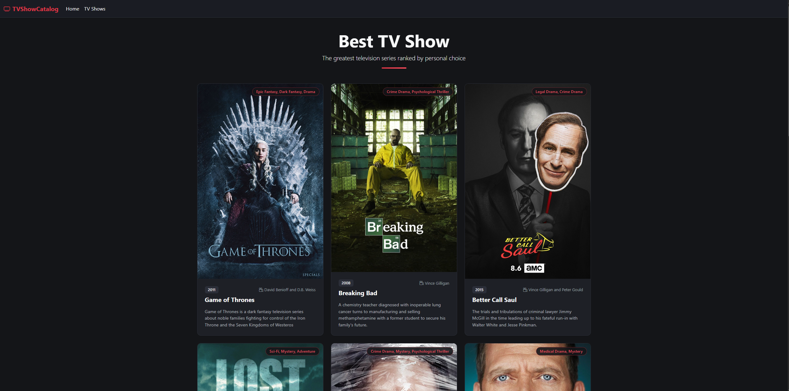
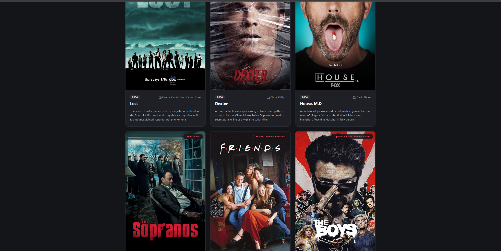
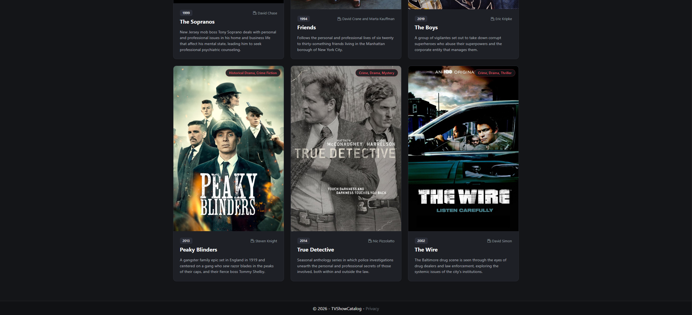

#  TV Shows Catalog (ASP.NET Core MVC)

A modern web application built with **ASP.NET Core MVC** and **Entity Framework Core (SQL Server)** that showcases a curated list of top television series.

##  Features
- **Database Integration**: Fetches show details (Title, Showrunner, Genre, Premiere Date, Poster, Description) dynamically from SQL Server.
- **Entity Framework Core**: Code-First architecture with automated table initialization and seeding.
- **Modern UI**: Custom dark-themed layout built with Bootstrap 5 and CSS grid.

##  Screenshots

---

##  Tech Stack
- **Framework**: ASP.NET Core MVC (.NET 8/9)
- **Database**: Microsoft SQL Server
- **ORM**: Entity Framework Core
- **Frontend**: Razor Views, Bootstrap 5, Custom CSS